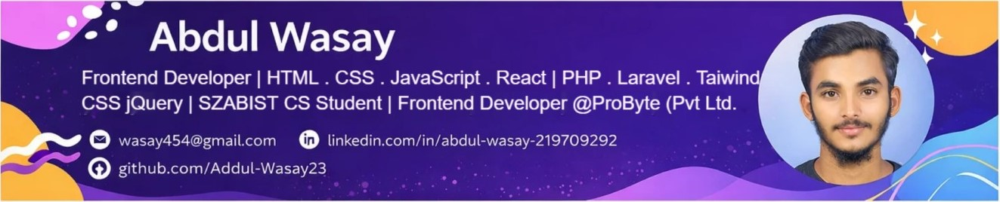

# ABDUL WASAY  
**Frontend Developer with 2+ Years Experience**

📍 Karachi, Pakistan  
Frontend Developer — [ProByte (Pvt) Ltd.](https://www.google.com/search?q=ProByte+Pvt+Ltd+Karachi)

---

## Connect With Me

  
  
  
  
  
  
  

---

## About Me

  Frontend Developer with **2+ years of hands-on experience** building responsive, user-friendly, and performance-optimized web applications using **HTML, CSS, JavaScript, and React.js**.  

  Skilled in creating optimized UI components, improving website performance and responsiveness. Familiar with **basic backend integration (PHP & Laravel)** and **CMS customization (WordPress & Shopify)**.  

  Currently pursuing **BS Computer Science at SZABIST University (5th Semester)** and passionate about scalable, clean, and high-performance frontend solutions.  

---

## Professional Experience

### Frontend Developer  
**ProByte (Pvt) Ltd. — Karachi**  
**March 2024 – Present**

- Developed responsive user interfaces using **HTML, CSS, JavaScript & React**
- Converted **UI/UX designs** into reusable, optimized frontend components

### Frontend Developer Intern  
**ProByte (Pvt) Ltd. — Karachi**  
**Jan 2024 – March 2024**

- Assisted in building responsive layouts using **HTML, CSS, and JavaScript**
- Learned **Git workflows** and collaborative development practices

---

## Skills

### Frontend
HTML5 • CSS3 • Tailwind CSS • Bootstrap • JavaScript (ES6+) • React.js  
Responsive Design • Performance Optimization  

### Backend (Basic)
PHP • Laravel  

### CMS / Tools
WordPress • Shopify • Git & GitHub  

---

## Languages

  
  
  
  
  
  
  
  
  
  

---

## Projects

### Frontend Projects (HTML • CSS • JavaScript)  

| Project Name | Description | Links |
|-------------|-------------|-------|
| **001-MedRx-Management-Llc** | Modern corporate frontend website    • **Tech:** HTML • CSS • JavaScript | [👁️ View](https://github.com/Abdul-Wasay23/Frontend-Projects-HTML-CSS-JS-/blob/main/001-MedRx-Management-Llc/MedRx-View.jpg) \| [💻 Code](https://github.com/Abdul-Wasay23/Frontend-Projects-HTML-CSS-JS-/tree/main/001-MedRx-Management-Llc) \| [⬇️ Download](https://github.com/Abdul-Wasay23/Frontend-Projects-HTML-CSS-JS-/raw/main/001-MedRx-Management-Llc/001-MedRx-Management-Llc.zip) \| [📘 README](https://github.com/Abdul-Wasay23/Frontend-Projects-HTML-CSS-JS-/blob/main/001-MedRx-Management-Llc/README.md) |
| **002-Devnest** | Corporate / business-style frontend website    • **Tech:** HTML • CSS • JavaScript | [👁️ View](https://github.com/Abdul-Wasay23/Frontend-Projects-HTML-CSS-JS-/blob/main/002-Devnest/Devnest-View.png) \| [💻 Code](https://github.com/Abdul-Wasay23/Frontend-Projects-HTML-CSS-JS-/tree/main/002-Devnest) \| [⬇️ Download](https://github.com/Abdul-Wasay23/Frontend-Projects-HTML-CSS-JS-/raw/main/002-Devnest/002-Devnest.zip) \| [📘 README](https://github.com/Abdul-Wasay23/Frontend-Projects-HTML-CSS-JS-/blob/main/002-Devnest/README.md) |
| **003-Mobile-Master** | E-commerce frontend website    • **Tech:** HTML • CSS • JavaScript | [👁️ View](./003-Mobile-Master/MobileMaster-View.png) \| [💻 Code](./003-Mobile-Master) \| [⬇️ Download](https://github.com/Abdul-Wasay23/Frontend-Projects-HTML-CSS-JS-/raw/main/003-Mobile-Master/003-Mobile-Master.zip) \| [📘 README](./003-Mobile-Master/README.md) |

---

### Tailwind CSS Projects  

| Project Name | Description | Links |
|-------------|-------------|-------|
| **001-Coastal-Beef** | E-commerce frontend website built with Tailwind CSS    • **Tech:** HTML • Tailwind CSS • JavaScript | [👁️ View](https://github.com/Abdul-Wasay23/Tailwind-Projects/blob/main/001-Coastal-Beef/Coastal-Beef-Desktop-View.png) \| [💻 Code](https://github.com/Abdul-Wasay23/Tailwind-Projects/tree/main/001-Coastal-Beef) \| [⬇️ Download](https://github.com/Abdul-Wasay23/Tailwind-Projects/raw/main/001-Coastal-Beef/001-Coastal-Beef.zip) \| [📘 README](https://github.com/Abdul-Wasay23/Tailwind-Projects/blob/main/001-Coastal-Beef/README.md) |

---

### React Projects
*Coming soon — building scalable React applications.*

---

### PHP / Laravel Projects

| Project Name | Description | Links |
|-------------|-------------|-------|
| **Nuvora Saloon** | Salon management system (Academic Project)    • **Tech:** HTML • CSS • JavaScript • PHP • Laravel | [🔗 GitHub Repository](https://github.com/Abdul-Wasay23/Nuvora-Saloon) |

---

## Contact Information

📍 Karachi, Pakistan  
📧 **wasay4546@gmail.com**  
📞 **+92 319 2020749**  
🌐 **https://abdul-wasay-portfolio-1.netlify.app**
